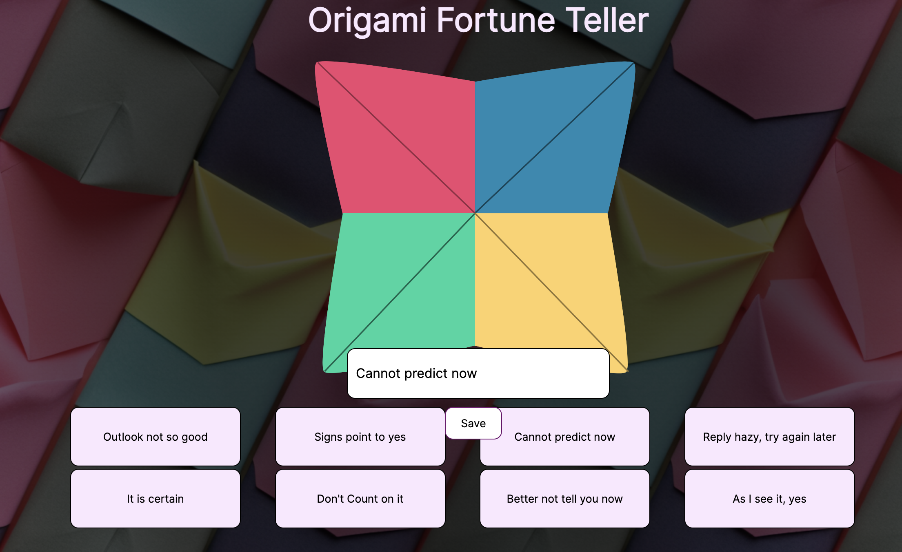

# Origami-Fortune-Teller

The [Origami-Fortune-Teller](https://cse110-sp23-group1.github.io/Origami-Fortune-Teller/) is a website designed to replicate the experience of the classic origami fortune teller game in a digital format. Users can interact with the website by inputting their desired fortunes into an input field. When the user clicks on the digital paper origami the app generates a random fortune based on the user's input. 

The website features a user-friendly interface that emulates the folding process of an origami fortune teller making it visually appealing to enhance the user experience. The technologies used consist of HTML, CSS, and JavaScript, making it compatible with modern web browsers. 

The main goal of this project is to provide an entertaining and interactive way for users to receive random fortunes. Whether used for fun or as a digital substitute for the traditional paper fortune teller, the Origami Fortune Teller App offers a nostalgic experience with a modern twist.

## How to use

1.  **Open the Fortune Teller:** Access the website by clicking [here](https://cse110-sp23-group1.github.io/Origami-Fortune-Teller/).
    
2.  **Explore the Buttons:** At the bottom of the webpage, you will find eight buttons. Each button represents the content for your fortune.
    
3.  **Change a fortune:** Click on one of the buttons with the content of the fortune you want to change. The button will display an input field.
    
4.  **Enter Your Fortune:** Enter the content of your fortune in the input field.
    
5.  **Save Your Fortune:** After entering your fortune, click the "Save" button to store it. The fortune will be saved and associated with the chosen button that you clicked.
    
6.  **Fold the Fortune Teller:** Once you have changed all the contents of the fortunes to that of your liking.  Interact with the fortune teller by clicking on one of the flaps of the paper origami which will trigger an animation. Repeat this action  until the origami turns into a square with numbers on it.
    
7.  **Enjoy the Fortunes:** Discover the hidden messages or fortunes you've saved by clicking one of the numbers which will unfold the paper origami and reveal the hidden fortune.
    
8.  **Resetting the Fortunes:** If you want to start fresh and delete all saved fortunes, you can click on the "Play Again" button. 
    
9.  **Have Fun!** Enjoy the interactive experience of the fortune origami teller.

## JSDocs Integration

JSDocs is implemented via GitHub Actions, where [JSDoc Action](https://github.com/andstor/jsdoc-action) is used to build and [GitHub Pages Deploy Action](https://github.com/JamesIves/github-pages-deploy-action) is used to deploy. Every time the `main` branch gets pushed, a GitHub pages webpage is automatically created. The contents of the webpage is deployed on another repository, where we can host a GitHub Pages webpage to show our documentation. 

Here is our [JSDocs webpage](https://cse110-sp23-group1.github.io/origami-jsdocs/)

## Contributing

To contribute, see our [contributor guide](CONTRIBUTING.md).
